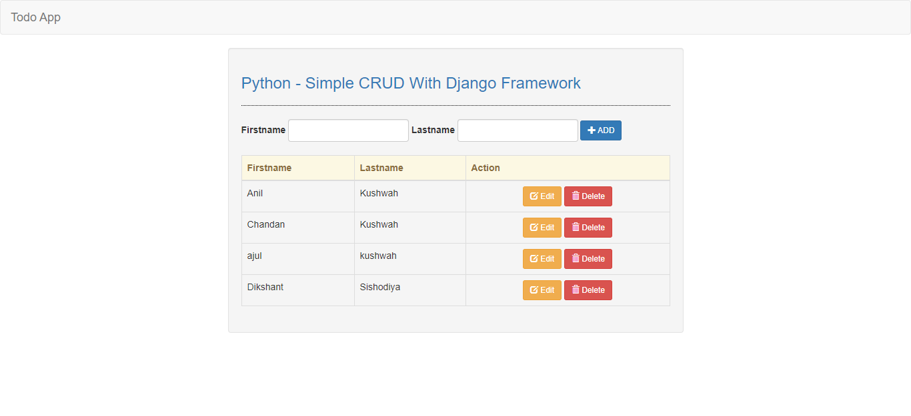

# Todo-App
<a href="https://todo-in-django.herokuapp.com/">https://todo-in-django.herokuapp.com/</a>



## Usage

crud/models.py
```python
from django.db import models

# Create your models here.

class Member(models.Model):
    firstname = models.CharField(max_length=40)
    lastname = models.CharField(max_length=40)

    def __str__(self):
        return self.firstname + " " + self.lastname
```

crud/views.py
```python
from django.shortcuts import render, redirect
from .models import Member

# Create your views here.

def index(request):
    members = Member.objects.all()
    context = {'members': members}
    return render(request, 'crud/index.html', context)

def create(request):
    member = Member(firstname=request.POST['firstname'], lastname=request.POST['lastname'])
    member.save()
    return redirect('/')

def edit(request, id):
    members = Member.objects.get(id=id)
    context = {'members': members}
    return render(request, 'crud/edit.html', context)

def update(request, id):
    member = Member.objects.get(id=id)
    member.firstname = request.POST['firstname']
    member.lastname = request.POST['lastname']
    member.save()
    return redirect('/crud/')

def delete(request, id):
    member = Member.objects.get(id=id)
    member.delete()
    return redirect('/crud/')
```

crud/urls.py
```python
from django.urls import path
from . import views

urlpatterns= [
    path('', views.index, name='index'),
    path('create', views.create, name='create'),
    path('edit/<int:id>', views.edit, name='edit'),
    path('edit/update/<int:id>', views.update, name='update'),
    path('delete/<int:id>', views.delete, name='delete'),
]
```

web/view.py
```python
from django.shortcuts import redirect

def index_redirect(request):
    return  redirect('/crud/')
```


web/urls.py
```python
from django.contrib import admin
from django.urls import path,include
from . import views

urlpatterns = [
    path('', views.index_redirect, name='index_redirect'),
    path('crud/', include('crud.urls')),
    path('admin/', admin.site.urls),
]
```


